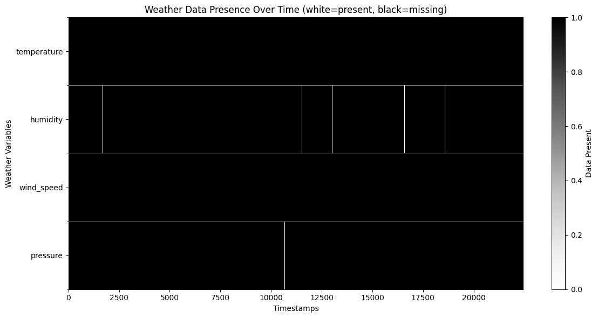
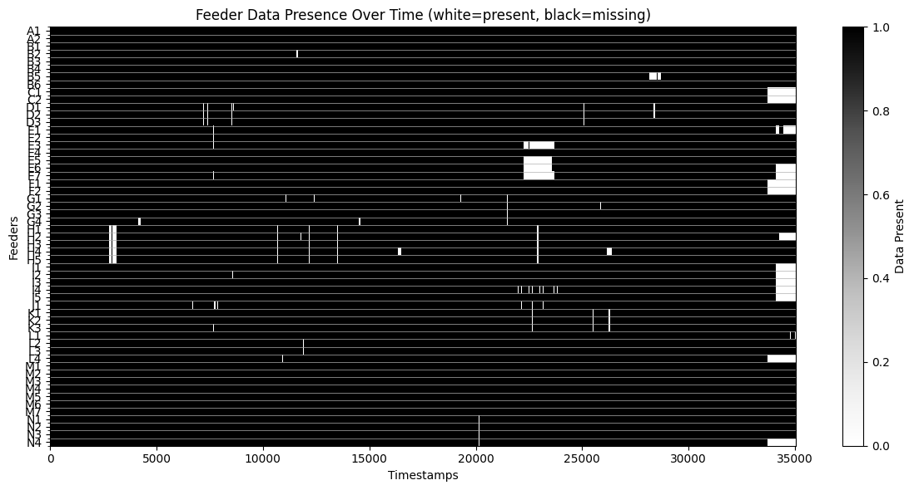

# Tasks

## Data Exploration (10) 
**a.** Explore the dataset by displaying the first few rows, summary statistics, and data types of each column. 

Trivial .. 

**b.** Identify missing values, outliers, and unique values in categorical columns. 

**Missing Values in Weather data**  

**Missing Values in Feeder data**  

See the notebooks for initial exploration of this:
- missing_values.ipynb

## Data Cleaning (20) 
**a.** Handling Missing Values 

TODO!

- Something to use might be the correlation between the diffrent feeders to impute missing values.
    - See 'correlation.ipynb' for initial exploration of this.

**b.** Choose appropriate methods to handle missing values (e.g., mean/median imputation for numerical data, mode imputation for categorical data, or deletion of rows/columns). 

TODO!

**c.** Justify your choices for handling missing data. 
## Handling Outliers (20) 
**a.** Detect outliers using methods such as the IQR method or Z-score. 

See 'visualizing_consumtion_data.ipynb' and 'visualizing_weather_data.ipynb' for initial exploration of this.

**b.** Decide whether to remove, cap, or transform the outliers. Justify your decisions. 

TODO!